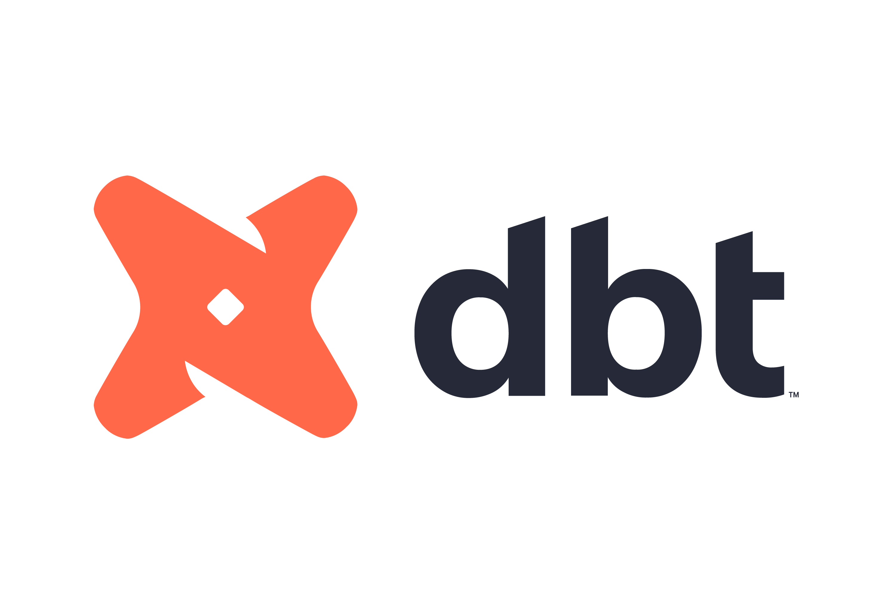
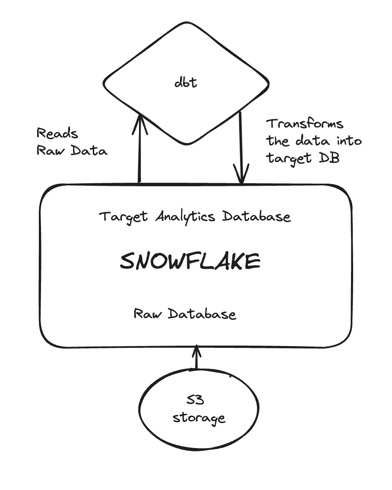
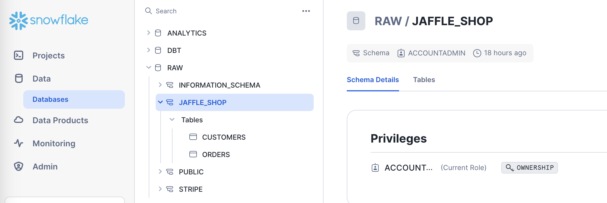
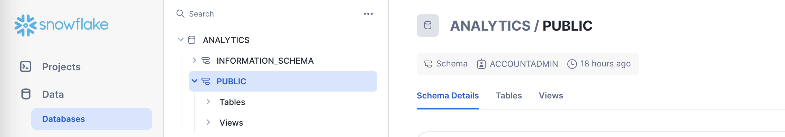
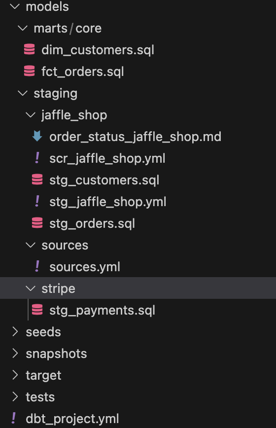
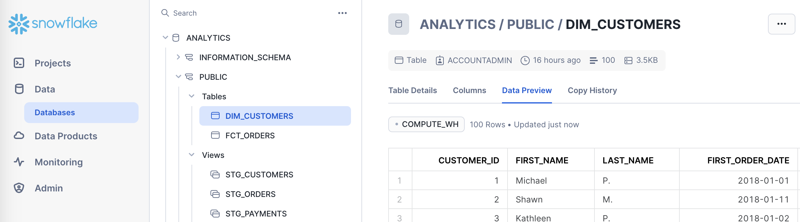

<div align="center">
 <br />


# Dbt Project


</div>

## :bookmark_tabs: Menu

- [Business Problem](#Business-Problem)
- [Snowflake](#Snowflake)
- [Dbt core](#dbt-core)
- [Documentation](#documentation)
- [Resources](#resources)
- [Author](#smiley_cat-author)


## Business problem


This project aims to enhance data analytics efficiency by combining dbt (Data Build Tool) with Snowflake, a leading cloud data platform. By automating data transformation and leveraging Snowflake's scalability, the project seeks to streamline workflows, improve data quality, and empower stakeholders with faster insights.

Key Objectives:

Implement dbt to automate data transformation processes.
Integrate Snowflake as the primary data warehouse for scalability and performance.
Establish version-controlled data modeling framework for transparency and collaboration.
Develop analytical models to generate actionable insights.
Enable self-service analytics through user-friendly dashboards.

Project Phases:

Planning and Setup: Define project scope, assess existing infrastructure, and configure Snowflake and dbt.
Data Modeling: Develop dbt models to transform raw data into curated datasets.
Quality Assurance: Test dbt models and data transformations for accuracy and completeness.
Deployment: Roll out dbt models into production, conduct user training, and monitor performance.
Governance: Implement data governance policies and security measures for compliance.

Benefits:

Agility: Agile data transformation workflows enable quick adaptation to changing needs.
Scalability: Snowflake's architecture accommodates growing data volumes and workloads.
Accelerated Insights: Automated data transformation provides faster access to reliable datasets.
Collaboration: Version-controlled modeling fosters collaboration among data teams.
Cost Savings: Streamlined operations reduce manual effort and infrastructure costs.

The architectural framework of the project is thoughtfully segmented into three main components, as follows:


- #### Data Procurement <font color='gray'> (by S3 bucket connection) </font>
- #### Data Preperation  <font color='gray'>(by using Snowflake) </font>
- #### Data Transformation <font color='gray'>(by using dbt) </font>


Here is the overall architecture flow:





# Snowflake

#### Data Warehouse and ETL with SQL

In this part, data is loaded into Snowflake and Data exploration and data preperation has been completed.

Two main databases in Snowflake have been created, one raw data database and for dbt target one Analytics database.






Here are the database, schema and raw table creation SQLs in snowflake:


```console
create warehouse transforming;
create database raw;
create database analytics;
create schema raw.jaffle_shop;
create schema raw.stripe;

```

```console
create table raw.jaffle_shop.customers 
( id integer,
  first_name varchar,
  last_name varchar
);

```

```console
copy into raw.jaffle_shop.customers (id, first_name, last_name)
from 's3://dbt-tutorial-public/jaffle_shop_customers.csv'
file_format = (
    type = 'CSV'
    field_delimiter = ','
    skip_header = 1
    ); 

```

```console
create table raw.jaffle_shop.orders
( id integer,
  user_id integer,
  order_date date,
  status varchar,
  _etl_loaded_at timestamp default current_timestamp
);

```

```console
copy into raw.jaffle_shop.orders (id, user_id, order_date, status)
from 's3://dbt-tutorial-public/jaffle_shop_orders.csv'
file_format = (
    type = 'CSV'
    field_delimiter = ','
    skip_header = 1
    );

```

```console
create table raw.stripe.payment 
( id integer,
  orderid integer,
  paymentmethod varchar,
  status varchar,
  amount integer,
  created date,
  _batched_at timestamp default current_timestamp
);

```

```console
copy into raw.stripe.payment (id, orderid, paymentmethod, status, amount, created)
from 's3://dbt-tutorial-public/stripe_payments.csv'
file_format = (
    type = 'CSV'
    field_delimiter = ','
    skip_header = 1
    );

```

```console
select * from raw.jaffle_shop.customers;
select * from raw.jaffle_shop.orders;
select * from raw.stripe.payment;   

```
Here is the final table that has been used in the final analysis:


# dbt core 

#### Transformations

And as a next step Snowflake is connected with [dbt](https://docs.getdbt.com/guides/snowflake?step=4) then the transformations are performed.

Here is the folder structure of the project:



And the final views and tables are created in the analytics database within snow as followings:




# Documentation

Documentation for this project has been created by using dbt and documentation [link](http://localhost:8080/#!/source_list/jaffle_shop) can be found here.


## Resources:
- Learn more about dbt [in the docs](https://docs.getdbt.com/docs/introduction)
- Check out [Discourse](https://discourse.getdbt.com/) for commonly asked questions and answers
- Join the [chat](https://community.getdbt.com/) on Slack for live discussions and support
- Find [dbt events](https://events.getdbt.com) near you
- Check out [the blog](https://blog.getdbt.com/) for the latest news on dbt's development and best practices

## :smiley_cat: Author

- [@begussimo](https://github.com/begussimo)